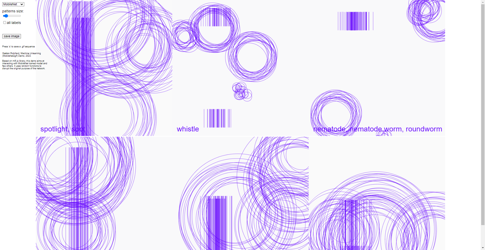

# Mobilenet2gif

Gaëtan Robillard, Machine Unlearning (MobileNet2gif) Demo, 2024.

Based on ml5.js library, this demo aims at interacting with MobileNet trained model and few others. It uses random functions to disrupt the original purpose of the network.

## Demo

See [http://robillardstudio.github.io/mobilenet2gif/index.html](http://robillardstudio.github.io/mobilenet2gif/index.html)